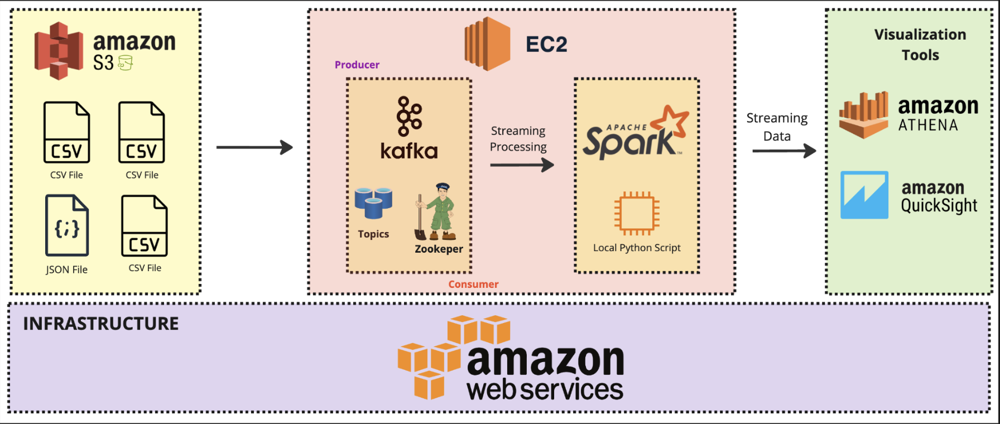
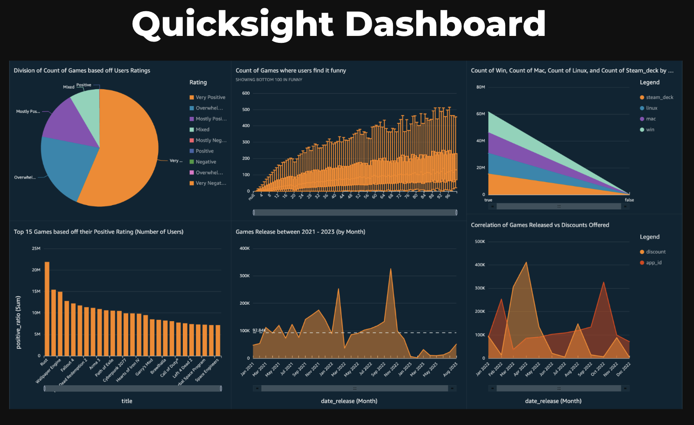
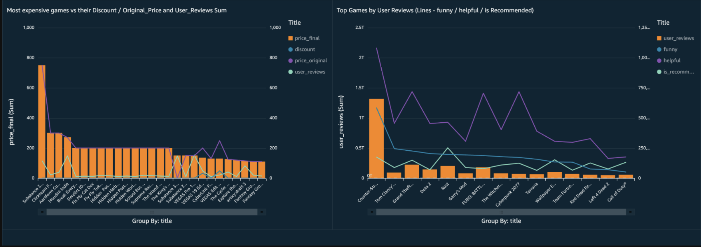

## Description
Steam is a marketplace for buying online games with over 30,000+ games listed and more than 120M active users every month making it the largest digital game distribution platform for PC gaming. 
Steam is available on Windows, Mac and Steam Deck.
The primary objective of this project is to develop an effective game recommendation system for Steam users. The system will leverage user interactions, game metadata, and community reviews to generate personalized game suggestions.
the goal is to create a recommendation system that not only simplifies game discovery but also enriches the overall gaming experience for Steam users.

## Architecture
 

## Final Result
 
 

